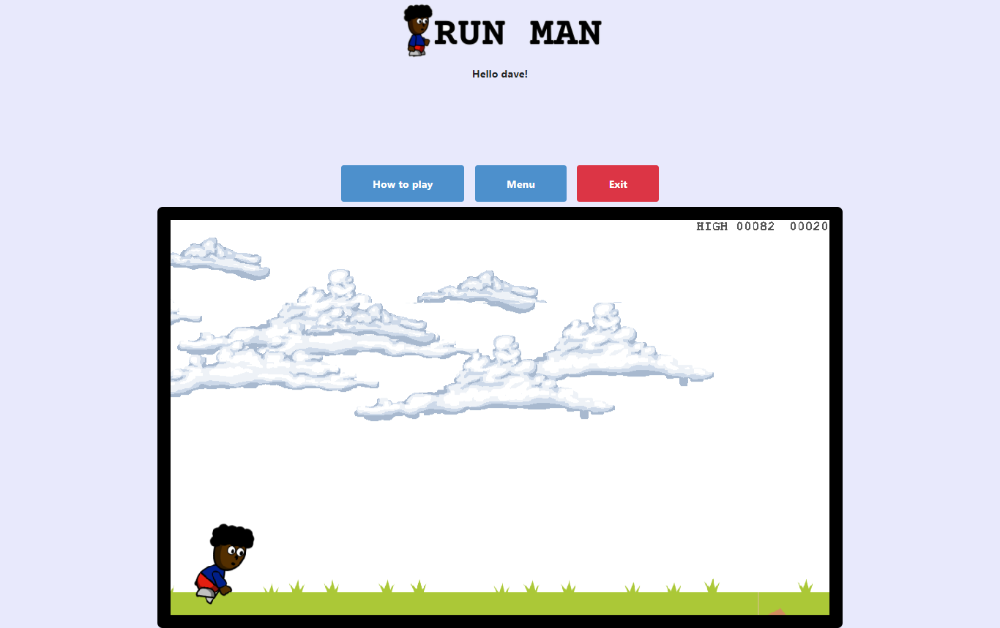

# Todo-List
In this project we built a turn-based RPG game using Phaser and JavaScript.

## Project screenshot

## 🔨 Built in

- JavaScript
- Webpack
- Bootstrap 4
- Phaser 3

## 🚀 Our Project

Our project can be found at https://github.com/daviidy/rpg-game

## How to play

## Live Demo

You can find the demo [here](https://daviidy.github.io/to-do-list/)

## To run the project in local

- make sure you have have NodeJS and NPM installed in your computer
- clone the repository from here [repo link](https://github.com/daviidy/rpg-game)
- navigate in your terminal to the folder `rpg-game`
- run `npm install`
- run `npm run start:dev`
- launch `localhost:8080` in your browser

## To run the tests
- npm run test

## 👨🏽‍💻 👨🏿‍💻 Creators

👤 **Author**

- Github: [@daviidy](https://github.com/daviidy)
- Twitter: [@davidyao3](https://twitter.com/DavidYao3)
- LinkedIn: [@daviidy](https://www.linkedin.com/in/david-yao-6bb95299/)
- Personal Website: [@daviidy](http://david-yao.com)

## 🤝 Contributing

Contributions, issues and feature requests are welcome!

## Show your support

Give a ⭐️ if you like this project!

## 📝 License

This project is no licensed.
